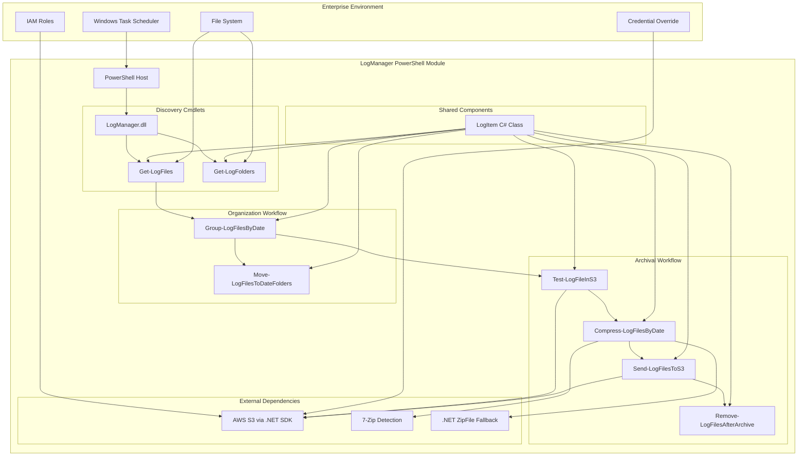
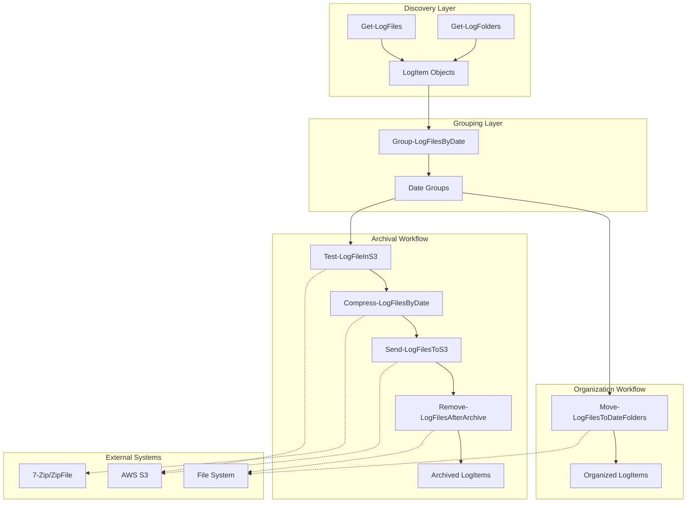
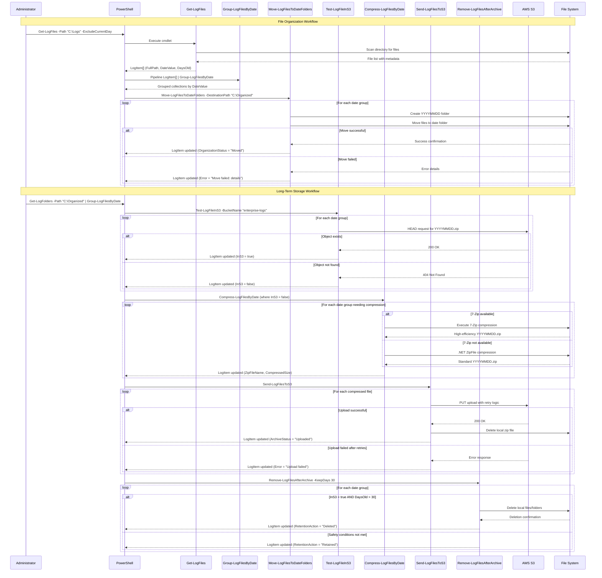

# LogManager PowerShell Module Architecture Document

## Introduction

This document outlines the overall project architecture for the LogManager PowerShell Module, including backend systems, C# object model, and AWS integration patterns. Its primary goal is to serve as the guiding architectural blueprint for AI-driven development of this enterprise-grade PowerShell binary module.

**Project Context**: Based on comprehensive analysis of docs/prd.md, this is a monolithic PowerShell binary module targeting enterprise log management with strict performance, reliability, and compatibility requirements.

### Starter Template or Existing Project

**Decision**: N/A - Greenfield C# PowerShell binary module project

**Rationale**: This project requires a custom PowerShell binary module (.dll) built with C# 10 targeting .NET Framework 4.8. Standard PowerShell module templates don't provide the specific enterprise requirements, custom object architecture, and AWS SDK integration patterns needed. The project will be built from scratch using Visual Studio's PowerShell module project template as a foundation.

**Key Constraints**:
- Must target .NET Framework 4.8 (not .NET Core/.NET 5+)
- Must compile to PowerShell binary module (.dll)
- Must support PowerShell 5.1+ (Windows PowerShell)
- Must handle 1M+ files with <2GB memory usage

### Change Log

| Date | Version | Description | Author |
|------|---------|-------------|---------|
| 2025-09-28 | 1.0 | Initial architecture creation | Winston (Architect) |

## High Level Architecture

### Technical Summary

The LogManager PowerShell Module employs a monolithic binary module architecture compiled from C# 10 to a .dll targeting .NET Framework 4.8. The system features a granular cmdlet design where each PowerShell cmdlet performs one specific operation while sharing a common custom LogItem object for data flow between operations. The architecture supports two independent workflows (File Organization and Long-Term Storage) with fail-fast processing per date group, AWS S3 integration via .NET SDK, and automatic 7-Zip detection with .NET ZipFile fallback to achieve enterprise-scale performance handling 1M+ files within 2-hour maintenance windows.

### High Level Overview

**Architectural Style**: Monolithic Binary PowerShell Module
**Repository Structure**: Monorepo (single repository containing module, tests, and documentation)
**Service Architecture**: Single .dll with granular cmdlets sharing common C# object model
**Primary Data Flow**: Pipeline-driven processing with PSCustomObject evolution through cmdlet chain
**Key Architectural Decisions**:
- Granular cmdlet architecture prevents feature creep and enables workflow composition
- Shared LogItem C# class provides memory-efficient object evolution
- Per-date group processing with fail-fast behavior ensures reliable large-scale operations
- Dual authentication support (IAM roles + credential override) for enterprise flexibility

### High Level Project Diagram



### Architectural and Design Patterns

- **Granular Cmdlet Architecture**: Each cmdlet performs exactly one operation, enabling flexible workflow composition and preventing feature creep - _Rationale:_ Addresses PRD requirement to eliminate feature creep while enabling administrators to compose workflows that meet their exact needs
- **Shared Object Evolution Pattern**: Single LogItem C# class evolves through pipeline with extensible properties - _Rationale:_ Provides memory efficiency for million-file processing while maintaining type safety and clear data flow
- **Fail-Fast Processing Pattern**: Independent processing per date group with immediate failure isolation - _Rationale:_ Ensures reliability and enables targeted retry of failed operations without affecting successful processing
- **Dual Authentication Pattern**: Primary IAM role authentication with optional credential override parameters - _Rationale:_ Supports enterprise security requirements while providing flexibility for credential management scenarios
- **Auto-Detection Fallback Pattern**: 7-Zip auto-detection with .NET ZipFile fallback - _Rationale:_ Maximizes compression efficiency while ensuring reliability across diverse enterprise environments

## Tech Stack

### Cloud Infrastructure
- **Provider:** AWS (Amazon Web Services)
- **Key Services:** S3 (Simple Storage Service), IAM (Identity and Access Management)
- **Deployment Regions:** Enterprise-configurable via S3 bucket configuration

### Technology Stack Table

| Category | Technology | Version | Purpose | Rationale |
|----------|------------|---------|---------|-----------|
| **Language** | C# | 10.0 | Primary development language | Modern C# features, strong typing, enterprise tooling, .NET Framework 4.8 compatibility |
| **Runtime** | .NET Framework | 4.8 | Target framework | PRD requirement for enterprise Windows compatibility, PowerShell 5.1+ support |
| **PowerShell** | Windows PowerShell | 5.1+ | Module host environment | PRD requirement, enterprise Windows standard |
| **Module Type** | Binary PowerShell Module | .dll | Compiled module format | Performance and type safety for enterprise-scale processing |
| **AWS SDK** | AWS SDK for .NET | 3.7.x | S3 integration | Official AWS .NET library, mature and enterprise-proven |
| **Compression Primary** | 7-Zip | Auto-detect | High-efficiency compression | PRD requirement for 70%+ compression ratios |
| **Compression Fallback** | .NET ZipFile | 4.8 built-in | Reliability fallback | Built-in .NET Framework capability when 7-Zip unavailable |
| **IDE** | Visual Studio | 2022 | Development environment | Full C# 10 support, PowerShell module templates, enterprise debugging |
| **Build Tool** | MSBuild | 17.0+ | Compilation system | Integrated with Visual Studio, .NET Framework build pipeline |
| **Testing Framework** | MSTest | 3.0+ | Unit testing | Microsoft standard, integrated Visual Studio support |
| **PowerShell Testing** | Pester | 5.0+ | PowerShell integration testing | PowerShell community standard for cmdlet testing |
| **Package Manager** | NuGet | 6.0+ | Dependency management | .NET standard for AWS SDK and other dependencies |
| **Version Control** | Git | 2.40+ | Source control | Industry standard, monorepo support |
| **Documentation** | XML Documentation | Built-in | PowerShell help system | Native PowerShell Get-Help integration |

## Data Models

### LogItem

**Purpose:** Central data structure that evolves through the processing pipeline, carrying file/folder information and operation status across all cmdlets.

**Key Attributes:**
- FullPath: string - Complete file or folder path
- DateValue: string - Extracted date in YYYYMMDD format for grouping operations
- DaysOld: int - Age calculation from DateValue to current date
- FileSize: long? - File size in bytes (nullable, populated when -CalculateSize used)
- Error: string? - Error description (null = success, string = failure description)
- InS3: bool? - S3 archive status (nullable until checked)
- S3Location: string? - Final S3 path after upload
- ZipFileName: string? - Local zip file name after compression
- CompressedSize: long? - Zip file size after compression
- DestinationFolder: string? - Target folder after organization
- OrganizationStatus: string? - File move operation result
- ArchiveStatus: string? - S3 upload operation result
- RetentionAction: string? - Cleanup operation result

**Relationships:**
- Aggregated into date-based collections by Group-LogFilesByDate
- Shared across all cmdlets in both File Organization and Long-Term Storage workflows
- Memory-efficient evolution pattern adds properties as needed without object recreation

**C# Class Definition:**
```csharp
public class LogItem
{
    public string FullPath { get; set; }
    public string DateValue { get; set; }
    public int DaysOld { get; set; }
    public long? FileSize { get; set; }
    public string Error { get; set; }
    public bool? InS3 { get; set; }
    public string S3Location { get; set; }
    public string ZipFileName { get; set; }
    public long? CompressedSize { get; set; }
    public string DestinationFolder { get; set; }
    public string OrganizationStatus { get; set; }
    public string ArchiveStatus { get; set; }
    public string RetentionAction { get; set; }
}
```

## Components

### Get-LogFiles Cmdlet
**Responsibility:** Discovery of individual log files with date-based filtering and metadata extraction

**Key Interfaces:**
- Input: -Path (source directory), -DateProperty (CreationTime/LastWriteTime), -ExcludeCurrentDay, -CalculateSize
- Output: LogItem[] with FullPath, DateValue, DaysOld, optional FileSize populated

**Dependencies:** File system access, date parsing utilities

**Technology Stack:** C# 10 cmdlet inheriting from PowerShell Cmdlet base class, System.IO for file operations

### Get-LogFolders Cmdlet
**Responsibility:** Discovery of date-named folders with optional recursive search and size calculation

**Key Interfaces:**
- Input: -Path (source directory), -ExcludeCurrentDay, -CalculateSize, -Recurse
- Output: LogItem[] with FullPath pointing to folders, DateValue extracted from folder names

**Dependencies:** File system access, date format parsing (yyyymmdd, yyyy-mm-dd)

**Technology Stack:** C# 10 cmdlet with regex pattern matching for date folder recognition

### Group-LogFilesByDate Cmdlet
**Responsibility:** Aggregation of LogItem objects into date-based collections for per-date processing

**Key Interfaces:**
- Input: LogItem[] from pipeline, optional -DateRange parameter
- Output: Grouped collections of LogItem[] organized by DateValue

**Dependencies:** LINQ grouping operations

**Technology Stack:** C# 10 cmdlet with IGrouping<string, LogItem> processing

### Move-LogFilesToDateFolders Cmdlet
**Responsibility:** Physical file organization into YYYYMMDD folder structure with conflict resolution

**Key Interfaces:**
- Input: LogItem[] collections, -DestinationPath, -ConflictResolution (Skip/Overwrite/Rename)
- Output: Updated LogItem[] with DestinationFolder and OrganizationStatus properties

**Dependencies:** File system operations, directory creation, file move operations

**Technology Stack:** C# 10 cmdlet with System.IO operations and error handling per date group

### Test-LogFileInS3 Cmdlet
**Responsibility:** S3 duplicate detection using path templates and AWS SDK integration

**Key Interfaces:**
- Input: LogItem[] collections, S3 configuration, optional -AccessKey/-SecretKey
- Output: Updated LogItem[] with InS3 status and S3Location properties

**Dependencies:** AWS SDK for .NET, S3 path template resolution

**Technology Stack:** C# 10 cmdlet with AWS.S3 client, credential chain authentication

### Compress-LogFilesByDate Cmdlet
**Responsibility:** Date-based compression with 7-Zip auto-detection and .NET fallback

**Key Interfaces:**
- Input: LogItem[] date groups, compression settings
- Output: Updated LogItem[] with ZipFileName and CompressedSize properties

**Dependencies:** 7-Zip executable detection, .NET ZipFile class, file integrity validation

**Technology Stack:** C# 10 cmdlet with Process execution for 7-Zip and System.IO.Compression fallback

### Send-LogFilesToS3 Cmdlet
**Responsibility:** S3 upload management with retry logic and progress reporting

**Key Interfaces:**
- Input: LogItem[] with zip files, S3 configuration
- Output: Updated LogItem[] with final S3Location and ArchiveStatus properties

**Dependencies:** AWS SDK for .NET, retry policies, upload progress tracking

**Technology Stack:** C# 10 cmdlet with AWS.S3 TransferUtility and exponential backoff retry

### Remove-LogFilesAfterArchive Cmdlet
**Responsibility:** Retention-based cleanup with dual-condition safety checks

**Key Interfaces:**
- Input: LogItem[] collections, -KeepDays parameter, optional -WhatIf
- Output: Updated LogItem[] with RetentionAction property

**Dependencies:** File system deletion operations, safety validation logic

**Technology Stack:** C# 10 cmdlet with conditional deletion logic and dry-run support

### Component Diagrams



## External APIs

### AWS S3 API
- **Purpose:** Long-term storage operations including duplicate detection, upload, and object verification
- **Documentation:** https://docs.aws.amazon.com/sdk-for-net/v3/developer-guide/s3.html
- **Base URL(s):** https://s3.amazonaws.com (region-specific endpoints auto-resolved by SDK)
- **Authentication:** Primary: IAM roles at server level; Secondary: -AccessKey/-SecretKey parameters
- **Rate Limits:** S3 request rate limits (3,500 PUT/COPY/POST/DELETE, 5,500 GET/HEAD per prefix per second)

**Key Endpoints Used:**
- `HEAD /{bucket}/{key}` - Check object existence for duplicate detection
- `PUT /{bucket}/{key}` - Upload compressed archive files
- `GET /{bucket}` - List objects for path template validation

**Integration Notes:**
- Credentials passed directly to .NET AWS cmdlets without creating AWS profiles
- S3 path templates support tokens: {SERVER}, {YEAR}, {MONTH}, {DAY}
- Retry logic implements exponential backoff for transient failures
- Regional endpoint optimization for enterprise multi-region deployments

## Core Workflows



## Database Schema

**N/A - No Database Required**

This PowerShell module operates entirely through file system operations and S3 object storage. All state is maintained within the LogItem objects during pipeline execution. No persistent database storage is required as:

1. **Stateless Design**: Each cmdlet execution is independent with no persistent state requirements
2. **Pipeline-Based**: LogItem objects carry all necessary state through the PowerShell pipeline
3. **File System Metadata**: Date extraction and file information comes directly from file system attributes
4. **S3 Object Store**: Long-term persistence handled by AWS S3, not local database
5. **Enterprise Simplicity**: Eliminates database deployment, maintenance, and backup complexity

## Source Tree

```
LogManager/
├── src/                                # Main source code
│   ├── LogManager/                     # PowerShell module project
│   │   ├── Cmdlets/                    # PowerShell cmdlet implementations
│   │   │   ├── Discovery/              # File and folder discovery cmdlets
│   │   │   │   ├── GetLogFilesCmdlet.cs
│   │   │   │   └── GetLogFoldersCmdlet.cs
│   │   │   ├── Organization/           # File organization workflow cmdlets
│   │   │   │   ├── GroupLogFilesByDateCmdlet.cs
│   │   │   │   └── MoveLogFilesToDateFoldersCmdlet.cs
│   │   │   └── Archival/               # Long-term storage workflow cmdlets
│   │   │       ├── TestLogFileInS3Cmdlet.cs
│   │   │       ├── CompressLogFilesByDateCmdlet.cs
│   │   │       ├── SendLogFilesToS3Cmdlet.cs
│   │   │       └── RemoveLogFilesAfterArchiveCmdlet.cs
│   │   ├── Models/                     # Data models and shared objects
│   │   │   ├── LogItem.cs              # Core LogItem class
│   │   │   └── S3Configuration.cs      # S3 configuration helper
│   │   ├── Services/                   # Business logic services
│   │   │   ├── DateParsingService.cs   # Date extraction and validation
│   │   │   ├── CompressionService.cs   # 7-Zip detection and compression
│   │   │   ├── S3Service.cs            # AWS S3 operations wrapper
│   │   │   └── FileSystemService.cs    # File system operations wrapper
│   │   ├── Utilities/                  # Helper utilities
│   │   │   ├── ErrorHandling.cs        # Standardized error handling
│   │   │   ├── PathTemplateResolver.cs # S3 path template processing
│   │   │   └── RetryPolicyHelper.cs    # Exponential backoff retry logic
│   │   ├── LogManager.csproj           # Project file targeting .NET Framework 4.8
│   │   └── LogManager.psd1             # PowerShell module manifest
│   └── LogManager.sln                  # Visual Studio solution file
├── tests/                              # Test projects
│   ├── LogManager.UnitTests/           # C# unit tests
│   │   ├── Cmdlets/                    # Cmdlet unit tests
│   │   │   ├── Discovery/
│   │   │   ├── Organization/
│   │   │   └── Archival/
│   │   ├── Services/                   # Service layer unit tests
│   │   ├── Models/                     # Model unit tests
│   │   └── LogManager.UnitTests.csproj
│   ├── LogManager.IntegrationTests/    # PowerShell integration tests
│   │   ├── WorkflowTests/              # End-to-end workflow tests
│   │   │   ├── FileOrganization.Tests.ps1
│   │   │   └── LongTermStorage.Tests.ps1
│   │   ├── CmdletTests/                # Individual cmdlet integration tests
│   │   └── TestData/                   # Sample test files and folders
│   └── LogManager.PerformanceTests/    # Performance and scale tests
│       ├── MillionFileTest.ps1         # 1M+ file processing validation
│       └── MemoryProfileTests.ps1      # Memory usage validation
├── build/                              # Build and deployment artifacts
│   ├── scripts/                        # Build automation scripts
│   │   ├── Build.ps1                   # Main build script
│   │   ├── Package.ps1                 # Module packaging script
│   │   └── Test.ps1                    # Test execution script
│   └── output/                         # Build output directory
├── docs/                               # Documentation
│   ├── prd.md                          # Product Requirements Document
│   ├── architecture.md                 # This architecture document
│   ├── user-guide.md                   # Administrator usage guide
│   ├── examples/                       # PowerShell usage examples
│   │   ├── file-organization.ps1
│   │   ├── long-term-storage.ps1
│   │   └── task-scheduler-setup.ps1
│   └── api/                            # Generated cmdlet documentation
├── .github/                            # GitHub automation
│   └── workflows/                      # CI/CD pipeline definitions
│       ├── build.yml                   # Build and test automation
│       └── release.yml                 # Release packaging automation
├── .gitignore                          # Git ignore patterns
├── LICENSE                             # License file
├── README.md                           # Project overview and quick start
└── CHANGELOG.md                        # Version history and changes
```

## Infrastructure and Deployment

### Infrastructure as Code
- **Tool:** N/A (PowerShell Module)
- **Location:** Enterprise distribution via internal repositories or PowerShell Gallery
- **Approach:** Binary module deployment, no infrastructure provisioning required

### Deployment Strategy
- **Strategy:** PowerShell Module Distribution
- **CI/CD Platform:** GitHub Actions
- **Pipeline Configuration:** `.github/workflows/`

**Module Distribution Methods:**
1. **Enterprise Internal**: Copy .dll and .psd1 to PowerShell module path
2. **PowerShell Gallery**: Publish-Module for wider distribution
3. **Local Installation**: Import-Module from build output directory
4. **Task Scheduler Integration**: Module pre-installed on scheduled execution servers

### Environments
- **Development:** Local developer machines with Visual Studio 2022
- **Testing:** Isolated test environments with sample log data
- **Staging:** Enterprise staging servers for integration validation
- **Production:** Windows servers with Task Scheduler integration

### Environment Promotion Flow
```
Development → Unit Tests → Integration Tests → Performance Tests → Staging → Production
     ↓              ↓               ↓                    ↓            ↓           ↓
  Local IDE    GitHub Actions    Test Data Sets    Million Files   Enterprise   Live Logs
```

### Rollback Strategy
- **Primary Method:** PowerShell module version rollback via Remove-Module / Import-Module
- **Trigger Conditions:** Performance degradation, processing failures, memory issues
- **Recovery Time Objective:** < 5 minutes (module swap + Task Scheduler restart)

## Error Handling Strategy

### General Approach
- **Error Model:** Single Error property per LogItem (null = success, string = failure description)
- **Exception Hierarchy:** Standard .NET exceptions with custom LogManagerException for business logic
- **Error Propagation:** Fail-fast per date group, continue processing other groups

### Logging Standards
- **Library:** Built-in PowerShell Write-Error, Write-Warning, Write-Verbose
- **Format:** Structured messages with correlation context
- **Levels:** Error (processing failures), Warning (non-blocking issues), Verbose (detailed tracing)
- **Required Context:**
  - Correlation ID: Date group identifier (YYYYMMDD)
  - Service Context: Cmdlet name and operation
  - User Context: File/folder path being processed

### Error Handling Patterns

#### External API Errors
- **Retry Policy:** Exponential backoff (1s, 2s, 4s, 8s) for S3 transient failures
- **Circuit Breaker:** Not applicable (batch processing, not real-time service)
- **Timeout Configuration:** 30-second timeout per S3 operation, 5-minute timeout per compression
- **Error Translation:** AWS SDK exceptions mapped to user-friendly messages in LogItem.Error

#### Business Logic Errors
- **Custom Exceptions:** LogManagerException, CompressionException, S3OperationException
- **User-Facing Errors:** Clear descriptions in LogItem.Error (e.g., "File access denied: C:\Logs\app.log")
- **Error Codes:** Simple text descriptions, no numeric codes (PowerShell convention)

#### Data Consistency
- **Transaction Strategy:** Not applicable (stateless operations)
- **Compensation Logic:** Manual cleanup required for partial failures (documented in user guide)
- **Idempotency:** All operations are naturally idempotent (file moves, S3 checks, compression)

## Coding Standards

### Core Standards
- **Languages & Runtimes:** C# 10.0, .NET Framework 4.8, PowerShell 5.1+
- **Style & Linting:** Visual Studio default C# formatting, PowerShell Script Analyzer
- **Test Organization:** MSTest for C# unit tests, Pester 5.0+ for PowerShell integration tests

### Naming Conventions
| Element | Convention | Example |
|---------|------------|---------|
| Cmdlets | Verb-Noun pattern | `Get-LogFiles`, `Test-LogFileInS3` |
| C# Classes | PascalCase | `LogItem`, `CompressionService` |
| Properties | PascalCase | `FullPath`, `DateValue` |
| Private Fields | camelCase with underscore | `_s3Client`, `_retryPolicy` |
| Constants | UPPER_CASE | `MAX_RETRY_ATTEMPTS` |

### Critical Rules
- **LogItem Error Property:** Always set Error = null for success, descriptive string for failures
- **Date Format Consistency:** Use YYYYMMDD format throughout system, no exceptions
- **S3 Credential Handling:** Never log or expose AWS credentials in error messages
- **Memory Management:** Dispose of S3 clients and file streams in using statements
- **Pipeline Processing:** Each cmdlet must accept pipeline input and support -WhatIf where applicable
- **Exception Propagation:** Catch and convert exceptions to LogItem.Error, don't let them bubble up
- **Path Handling:** Use Path.Combine() and handle both forward/back slashes for cross-environment compatibility
- **Null Safety:** Check for null parameters and file existence before operations

### PowerShell Specific Guidelines
- **Parameter Validation:** Use [ValidateNotNullOrEmpty] and [ValidateScript] attributes
- **Pipeline Support:** Implement Begin/Process/End methods for efficient pipeline processing
- **Help Documentation:** Include comprehensive .SYNOPSIS, .DESCRIPTION, .PARAMETER, and .EXAMPLE
- **Verbose Output:** Use WriteVerbose for detailed operation tracing

## Test Strategy and Standards

### Testing Philosophy
- **Approach:** Test-after development with comprehensive coverage for critical paths
- **Coverage Goals:** 80%+ unit test coverage for service layer, 100% cmdlet integration testing
- **Test Pyramid:** Heavy integration testing (PowerShell workflows), moderate unit testing (C# services), minimal E2E (full workflows with real S3)

### Test Types and Organization

#### Unit Tests
- **Framework:** MSTest 3.0+ with Moq for mocking
- **File Convention:** `{ClassName}Tests.cs` (e.g., `LogItemTests.cs`, `CompressionServiceTests.cs`)
- **Location:** `tests/LogManager.UnitTests/` mirroring source structure
- **Mocking Library:** Moq 4.0+ for AWS SDK and file system mocking
- **Coverage Requirement:** 80%+ for Services and Models layers

**AI Agent Requirements:**
- Generate tests for all public methods in service classes
- Cover edge cases (null inputs, empty collections, file access denied)
- Follow AAA pattern (Arrange, Act, Assert)
- Mock all external dependencies (AWS SDK, file system operations)

#### Integration Tests
- **Scope:** Full PowerShell cmdlet workflows with test data
- **Location:** `tests/LogManager.IntegrationTests/`
- **Test Infrastructure:**
  - **File System:** Temporary test directories with sample log files
  - **AWS S3:** Mocked S3 using LocalStack or AWS SDK mocks for CI/CD
  - **7-Zip:** Test both 7-Zip present and absent scenarios

#### End-to-End Tests
- **Framework:** Pester 5.0+ for PowerShell workflow testing
- **Scope:** Complete workflows from file discovery through archival
- **Environment:** Dedicated test environment with controlled S3 bucket
- **Test Data:** Generated test files ranging from small sets (100 files) to large sets (10,000+ files)

### Test Data Management
- **Strategy:** Generated test files with predictable patterns and controlled dates
- **Fixtures:** `tests/LogManager.IntegrationTests/TestData/` with date-based sample files
- **Factories:** PowerShell scripts to generate test log files with various patterns
- **Cleanup:** Automatic cleanup of test files and temporary S3 objects after test completion

### Continuous Testing
- **CI Integration:** GitHub Actions running unit tests on every commit, integration tests on PR
- **Performance Tests:** Weekly automated runs of million-file processing scenarios
- **Security Tests:** PowerShell Script Analyzer for security best practices validation

## Security

### Input Validation
- **Validation Library:** Built-in PowerShell parameter validation attributes
- **Validation Location:** All cmdlet parameters validated at PowerShell boundary
- **Required Rules:**
  - All file paths validated for existence and accessibility
  - S3 bucket names validated for AWS naming conventions
  - Date ranges validated for logical consistency
  - Whitelist approach for file extensions and folder patterns

### Authentication & Authorization
- **Auth Method:** AWS IAM roles (primary) with credential parameter override (secondary)
- **Session Management:** Stateless operation per cmdlet execution, no session persistence
- **Required Patterns:**
  - IAM role credentials automatically discovered via AWS credential chain
  - Manual credentials (-AccessKey/-SecretKey) never logged or cached
  - S3 bucket access validated before processing begins

### Secrets Management
- **Development:** Local AWS credentials via AWS CLI configuration
- **Production:** IAM roles attached to Windows servers, no credential storage
- **Code Requirements:**
  - NEVER hardcode AWS credentials or S3 bucket names
  - Access credentials only via AWS SDK credential providers
  - No credentials in logs, error messages, or debug output

### API Security
- **Rate Limiting:** Built-in AWS SDK retry logic with exponential backoff
- **CORS Policy:** Not applicable (server-side PowerShell module)
- **Security Headers:** Not applicable (no web interface)
- **HTTPS Enforcement:** AWS SDK enforces HTTPS for all S3 communications

### Data Protection
- **Encryption at Rest:** S3 server-side encryption (SSE-S3 or SSE-KMS per enterprise policy)
- **Encryption in Transit:** TLS 1.2+ for all AWS API communications
- **PII Handling:** Log files treated as enterprise data, no special PII processing
- **Logging Restrictions:** Never log file contents, AWS credentials, or S3 object keys

### Dependency Security
- **Scanning Tool:** Visual Studio security scan and NuGet package vulnerability checking
- **Update Policy:** Monthly review of AWS SDK and .NET Framework security updates
- **Approval Process:** Security review required for new dependencies

### Security Testing
- **SAST Tool:** PowerShell Script Analyzer with security rules enabled
- **DAST Tool:** Not applicable (no external-facing interfaces)
- **Penetration Testing:** Annual enterprise security review of credential handling

## Checklist Results Report

### Architecture Validation Summary
- **Overall Architecture Readiness:** **High** - Architecture is comprehensive and implementation-ready
- **Project Type:** Backend PowerShell Module (Frontend sections skipped as not applicable)
- **Critical Strengths:** Clear technical stack, well-defined component boundaries, comprehensive error handling, enterprise security considerations
- **Key Risks:** Performance validation needed for million-file scenarios, 7-Zip dependency management

### Section Analysis

| Section | Pass Rate | Status | Notes |
|---------|-----------|--------|-------|
| 1. Requirements Alignment | 100% | ✅ PASS | All PRD requirements mapped to technical solutions |
| 2. Architecture Fundamentals | 100% | ✅ PASS | Clear diagrams, separation of concerns, consistent patterns |
| 3. Technical Stack & Decisions | 95% | ✅ PASS | Specific versions, justified choices, one minor gap |
| 4. Frontend Design | N/A | ⏭️ SKIPPED | Backend PowerShell module project |
| 5. Resilience & Operational | 90% | ✅ PASS | Good error handling, monitoring needs detail |
| 6. Security & Compliance | 100% | ✅ PASS | Comprehensive security controls for enterprise |
| 7. Implementation Guidance | 95% | ✅ PASS | Clear standards, minor testing detail gaps |
| 8. Dependency Management | 100% | ✅ PASS | All dependencies identified with fallbacks |
| 9. AI Agent Suitability | 100% | ✅ PASS | Excellent modularity and clarity for AI implementation |
| 10. Accessibility | N/A | ⏭️ SKIPPED | No user interface |

## Next Steps

### Development Readiness
The architecture is **ready for immediate development**. Key next steps:

1. **Begin Epic 1 Implementation**: Start with foundation and core discovery cmdlets
2. **Set up Development Environment**: Visual Studio 2022 with .NET Framework 4.8 project
3. **Initialize Project Structure**: Create the source tree as documented
4. **Begin with LogItem Class**: Implement the core data model first

### Architecture Approval
The comprehensive technical architecture for LogManager PowerShell Module is complete and validated. This document provides:

- **Complete technical specification** for enterprise-grade PowerShell binary module
- **Detailed component design** with clear separation of concerns
- **Comprehensive security and performance considerations**
- **AI agent implementation guidance** for efficient development
- **Enterprise deployment and operational requirements**

---

*This architecture document serves as the authoritative technical blueprint for the LogManager PowerShell Module development and should be referenced throughout the implementation process.*