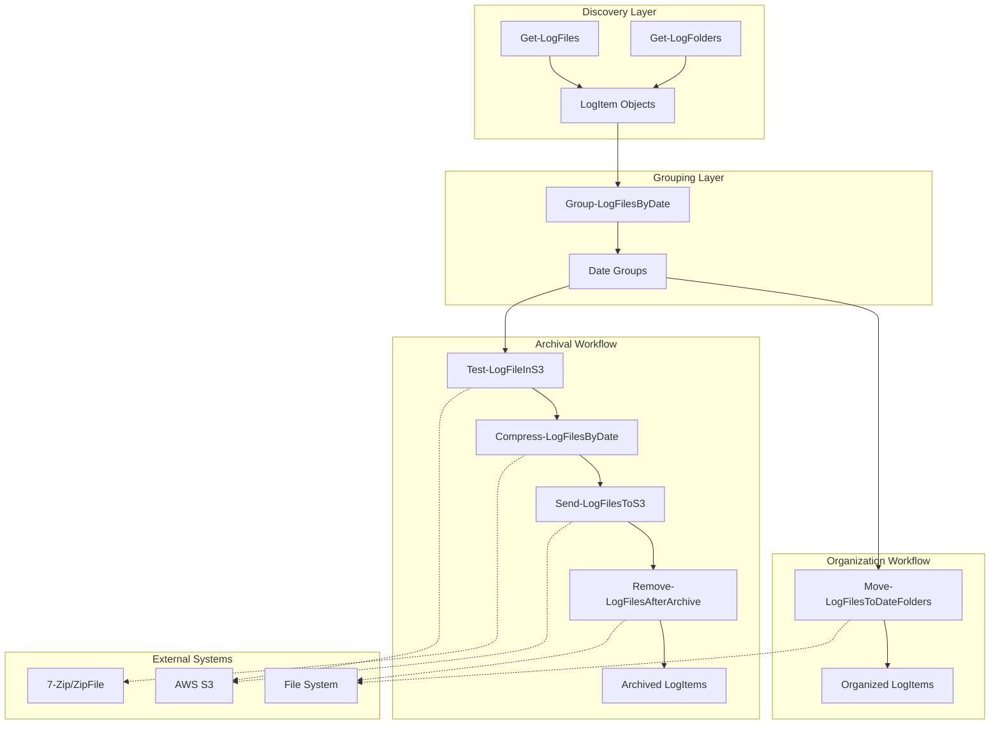

# Components

## Get-LogFiles Cmdlet
**Responsibility:** Discovery of individual log files with date-based filtering and metadata extraction

**Key Interfaces:**
- Input: -Path (source directory), -DateProperty (CreationTime/LastWriteTime), -ExcludeCurrentDay, -CalculateSize
- Output: LogItem[] with FullPath, DateValue, DaysOld, optional FileSize populated

**Dependencies:** File system access, date parsing utilities

**Technology Stack:** C# 10 cmdlet inheriting from PowerShell Cmdlet base class, System.IO for file operations

## Get-LogFolders Cmdlet
**Responsibility:** Discovery of date-named folders with optional recursive search and size calculation

**Key Interfaces:**
- Input: -Path (source directory), -ExcludeCurrentDay, -CalculateSize, -Recurse
- Output: LogItem[] with FullPath pointing to folders, DateValue extracted from folder names

**Dependencies:** File system access, date format parsing (yyyymmdd, yyyy-mm-dd)

**Technology Stack:** C# 10 cmdlet with regex pattern matching for date folder recognition

## Group-LogFilesByDate Cmdlet
**Responsibility:** Aggregation of LogItem objects into date-based collections for per-date processing

**Key Interfaces:**
- Input: LogItem[] from pipeline, optional -DateRange parameter
- Output: Grouped collections of LogItem[] organized by DateValue

**Dependencies:** LINQ grouping operations

**Technology Stack:** C# 10 cmdlet with IGrouping<string, LogItem> processing

## Move-LogFilesToDateFolders Cmdlet
**Responsibility:** Physical file organization into YYYYMMDD folder structure with conflict resolution

**Key Interfaces:**
- Input: LogItem[] collections, -DestinationPath, -ConflictResolution (Skip/Overwrite/Rename)
- Output: Updated LogItem[] with DestinationFolder and OrganizationStatus properties

**Dependencies:** File system operations, directory creation, file move operations

**Technology Stack:** C# 10 cmdlet with System.IO operations and error handling per date group

## Test-LogFileInS3 Cmdlet
**Responsibility:** S3 duplicate detection using path templates and AWS SDK integration

**Key Interfaces:**
- Input: LogItem[] collections, S3 configuration, optional -AccessKey/-SecretKey
- Output: Updated LogItem[] with InS3 status and S3Location properties

**Dependencies:** AWS SDK for .NET, S3 path template resolution

**Technology Stack:** C# 10 cmdlet with AWS.S3 client, credential chain authentication

## Compress-LogFilesByDate Cmdlet
**Responsibility:** Date-based compression with 7-Zip auto-detection and .NET fallback

**Key Interfaces:**
- Input: LogItem[] date groups, compression settings
- Output: Updated LogItem[] with ZipFileName and CompressedSize properties

**Dependencies:** 7-Zip executable detection, .NET ZipFile class, file integrity validation

**Technology Stack:** C# 10 cmdlet with Process execution for 7-Zip and System.IO.Compression fallback

## Send-LogFilesToS3 Cmdlet
**Responsibility:** S3 upload management with retry logic and progress reporting

**Key Interfaces:**
- Input: LogItem[] with zip files, S3 configuration
- Output: Updated LogItem[] with final S3Location and ArchiveStatus properties

**Dependencies:** AWS SDK for .NET, retry policies, upload progress tracking

**Technology Stack:** C# 10 cmdlet with AWS.S3 TransferUtility and exponential backoff retry

## Remove-LogFilesAfterArchive Cmdlet
**Responsibility:** Retention-based cleanup with dual-condition safety checks

**Key Interfaces:**
- Input: LogItem[] collections, -KeepDays parameter, optional -WhatIf
- Output: Updated LogItem[] with RetentionAction property

**Dependencies:** File system deletion operations, safety validation logic

**Technology Stack:** C# 10 cmdlet with conditional deletion logic and dry-run support

## Component Diagrams

