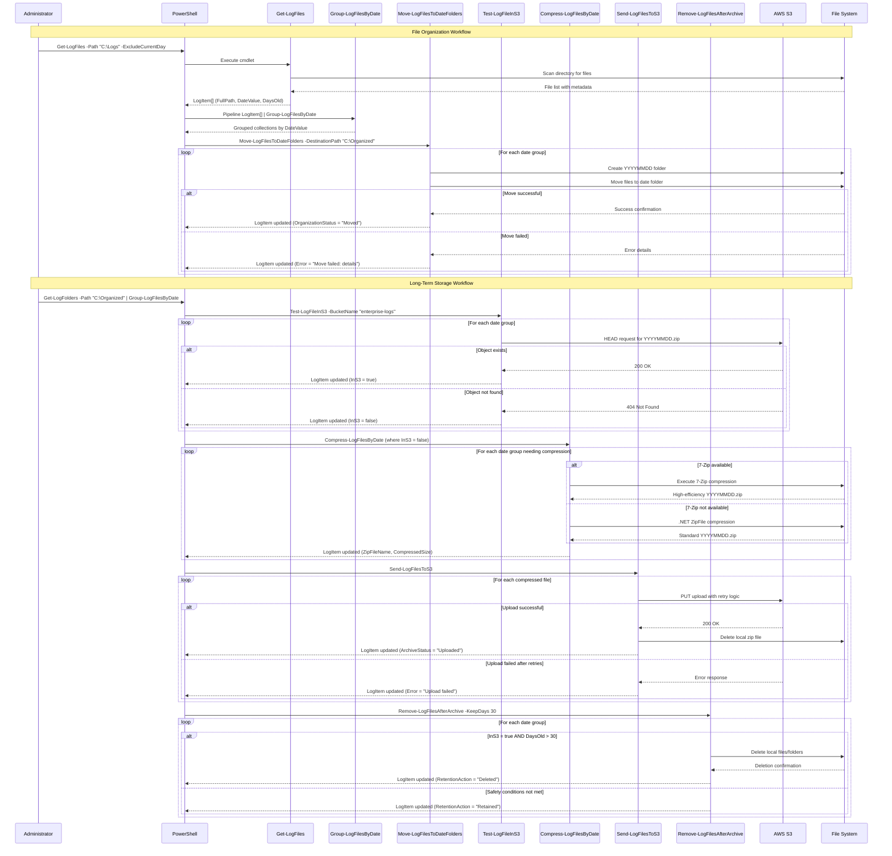

# Core Workflows

```mermaid
sequenceDiagram
    participant Admin as Administrator
    participant PS as PowerShell
    participant GLF as Get-LogFiles
    participant GLFBD as Group-LogFilesByDate
    participant MLTDF as Move-LogFilesToDateFolders
    participant TLFIS3 as Test-LogFileInS3
    participant CLFBD as Compress-LogFilesByDate
    participant SLFTS3 as Send-LogFilesToS3
    participant RLFAA as Remove-LogFilesAfterArchive
    participant S3 as AWS S3
    participant FS as File System

    Note over Admin, FS: File Organization Workflow
    Admin->>PS: Get-LogFiles -Path "C:\Logs" -ExcludeCurrentDay
    PS->>GLF: Execute cmdlet
    GLF->>FS: Scan directory for files
    FS-->>GLF: File list with metadata
    GLF-->>PS: LogItem[] (FullPath, DateValue, DaysOld)
    PS->>GLFBD: Pipeline LogItem[] | Group-LogFilesByDate
    GLFBD-->>PS: Grouped collections by DateValue
    PS->>MLTDF: Move-LogFilesToDateFolders -DestinationPath "C:\Organized"
    loop For each date group
        MLTDF->>FS: Create YYYYMMDD folder
        MLTDF->>FS: Move files to date folder
        alt Move successful
            FS-->>MLTDF: Success confirmation
            MLTDF-->>PS: LogItem updated (OrganizationStatus = "Moved")
        else Move failed
            FS-->>MLTDF: Error details
            MLTDF-->>PS: LogItem updated (Error = "Move failed: details")
        end
    end

    Note over Admin, FS: Long-Term Storage Workflow
    Admin->>PS: Get-LogFolders -Path "C:\Organized" | Group-LogFilesByDate
    PS->>TLFIS3: Test-LogFileInS3 -BucketName "enterprise-logs"
    loop For each date group
        TLFIS3->>S3: HEAD request for YYYYMMDD.zip
        alt Object exists
            S3-->>TLFIS3: 200 OK
            TLFIS3-->>PS: LogItem updated (InS3 = true)
        else Object not found
            S3-->>TLFIS3: 404 Not Found
            TLFIS3-->>PS: LogItem updated (InS3 = false)
        end
    end

    PS->>CLFBD: Compress-LogFilesByDate (where InS3 = false)
    loop For each date group needing compression
        alt 7-Zip available
            CLFBD->>FS: Execute 7-Zip compression
            FS-->>CLFBD: High-efficiency YYYYMMDD.zip
        else 7-Zip not available
            CLFBD->>FS: .NET ZipFile compression
            FS-->>CLFBD: Standard YYYYMMDD.zip
        end
        CLFBD-->>PS: LogItem updated (ZipFileName, CompressedSize)
    end

    PS->>SLFTS3: Send-LogFilesToS3
    loop For each compressed file
        SLFTS3->>S3: PUT upload with retry logic
        alt Upload successful
            S3-->>SLFTS3: 200 OK
            SLFTS3->>FS: Delete local zip file
            SLFTS3-->>PS: LogItem updated (ArchiveStatus = "Uploaded")
        else Upload failed after retries
            S3-->>SLFTS3: Error response
            SLFTS3-->>PS: LogItem updated (Error = "Upload failed")
        end
    end

    PS->>RLFAA: Remove-LogFilesAfterArchive -KeepDays 30
    loop For each date group
        alt InS3 = true AND DaysOld > 30
            RLFAA->>FS: Delete local files/folders
            FS-->>RLFAA: Deletion confirmation
            RLFAA-->>PS: LogItem updated (RetentionAction = "Deleted")
        else Safety conditions not met
            RLFAA-->>PS: LogItem updated (RetentionAction = "Retained")
        end
    end
```
