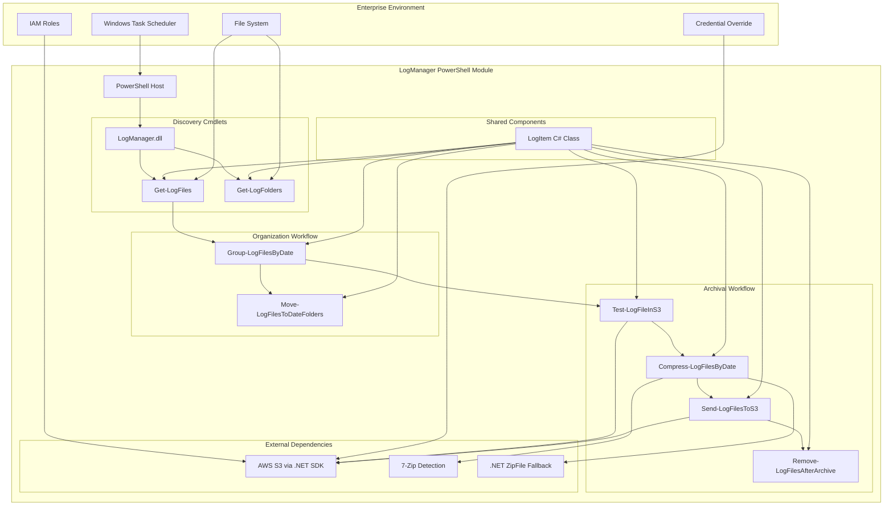

# High Level Architecture

## Technical Summary

The LogManager PowerShell Module employs a monolithic binary module architecture compiled from C# 10 to a .dll targeting .NET Framework 4.8. The system features a granular cmdlet design where each PowerShell cmdlet performs one specific operation while sharing a common custom LogItem object for data flow between operations. The architecture supports two independent workflows (File Organization and Long-Term Storage) with fail-fast processing per date group, AWS S3 integration via .NET SDK, and automatic 7-Zip detection with .NET ZipFile fallback to achieve enterprise-scale performance handling 1M+ files within 2-hour maintenance windows.

## High Level Overview

**Architectural Style**: Monolithic Binary PowerShell Module
**Repository Structure**: Monorepo (single repository containing module, tests, and documentation)
**Service Architecture**: Single .dll with granular cmdlets sharing common C# object model
**Primary Data Flow**: Pipeline-driven processing with PSCustomObject evolution through cmdlet chain
**Key Architectural Decisions**:
- Granular cmdlet architecture prevents feature creep and enables workflow composition
- Shared LogItem C# class provides memory-efficient object evolution
- Per-date group processing with fail-fast behavior ensures reliable large-scale operations
- Dual authentication support (IAM roles + credential override) for enterprise flexibility

## High Level Project Diagram

## Architectural and Design Patterns

- **Granular Cmdlet Architecture**: Each cmdlet performs exactly one operation, enabling flexible workflow composition and preventing feature creep - _Rationale:_ Addresses PRD requirement to eliminate feature creep while enabling administrators to compose workflows that meet their exact needs
- **Shared Object Evolution Pattern**: Single LogItem C# class evolves through pipeline with extensible properties - _Rationale:_ Provides memory efficiency for million-file processing while maintaining type safety and clear data flow
- **Fail-Fast Processing Pattern**: Independent processing per date group with immediate failure isolation - _Rationale:_ Ensures reliability and enables targeted retry of failed operations without affecting successful processing
- **Dual Authentication Pattern**: Primary IAM role authentication with optional credential override parameters - _Rationale:_ Supports enterprise security requirements while providing flexibility for credential management scenarios
- **Auto-Detection Fallback Pattern**: 7-Zip auto-detection with .NET ZipFile fallback - _Rationale:_ Maximizes compression efficiency while ensuring reliability across diverse enterprise environments
