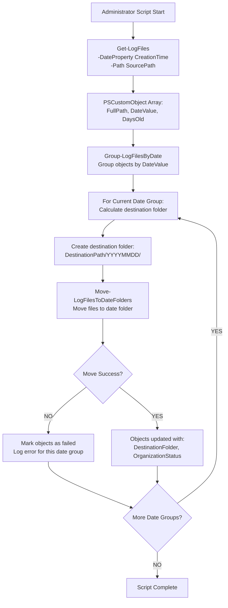

# File Organization Workflow



## Example Object State After Organization

```powershell
# Three example objects after file organization completion:

Object 1:
FullPath              : C:\logs\organized\20250925\app-morning.log
DateValue             : 20250925
DaysOld               : 2
FileSize              : 2.5MB
DestinationFolder     : C:\logs\organized\20250925\
OrganizationStatus    : Moved
Error                 : null

Object 2:
FullPath              : C:\logs\organized\20250924\system-error.log
DateValue             : 20250924
DaysOld               : 3
FileSize              : 850KB
DestinationFolder     : C:\logs\organized\20250924\
OrganizationStatus    : Moved
Error                 : null

Object 3:
FullPath              : C:\logs\source\debug-failed.log
DateValue             : 20250923
DaysOld               : 4
FileSize              : 1.2GB
DestinationFolder     : C:\logs\organized\20250923\
OrganizationStatus    : Failed
Error                 : "Access denied to destination folder"
```