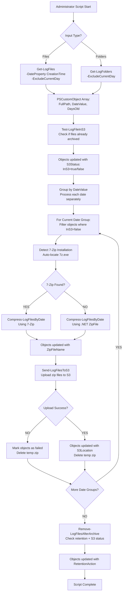

# Long-Term Storage Workflow



## Example Object State After Long-Term Storage

```powershell
# Three example objects after long-term storage completion:

Object 1:
FullPath              : null (deleted)
DateValue             : 20250925
DaysOld               : 2
FileSize              : 2.5MB
CompressedSize        : 650KB
ZipFileName           : 20250925.zip
S3Location            : s3://backup-bucket/PROD-WEB-01/2025/09/20250925.zip
ArchiveStatus         : Uploaded
RetentionAction       : Deleted
Error                 : null

Object 2:
FullPath              : C:\logs\app\system-recent.log
DateValue             : 20250926
DaysOld               : 1
FileSize              : 15MB
CompressedSize        : 3.2MB
ZipFileName           : 20250926.zip
S3Location            : s3://backup-bucket/PROD-WEB-01/2025/09/20250926.zip
ArchiveStatus         : Uploaded
RetentionAction       : Retained
Error                 : null

Object 3:
FullPath              : C:\logs\app\debug-failed.log
DateValue             : 20250924
DaysOld               : 3
FileSize              : 1.2GB
CompressedSize        : null
ZipFileName           : 20250924.zip
S3Location            : null
ArchiveStatus         : Failed
RetentionAction       : Retained
Error                 : "S3 authentication failed"

# Folder-based objects (Get-LogFolders input):

Object 4:
FullPath              : null (deleted)
DateValue             : 20250922
DaysOld               : 5
FileSize              : 45MB
CompressedSize        : 8.7MB
ZipFileName           : 20250922.zip
S3Location            : s3://backup-bucket/PROD-WEB-01/2025/09/20250922.zip
ArchiveStatus         : Uploaded
RetentionAction       : Deleted
Error                 : null

Object 5:
FullPath              : C:\logs\dated\20250921
DateValue             : 20250921
DaysOld               : 6
FileSize              : 2.3GB
CompressedSize        : 412MB
ZipFileName           : 20250921.zip
S3Location            : s3://backup-bucket/PROD-WEB-01/2025/09/20250921.zip
ArchiveStatus         : Uploaded
RetentionAction       : Retained
Error                 : null

Object 6:
FullPath              : C:\logs\dated\2025-09-20
DateValue             : 20250920
DaysOld               : 7
FileSize              : 1.8GB
CompressedSize        : null
ZipFileName           : 20250920.zip
S3Location            : null
ArchiveStatus         : Failed
RetentionAction       : Retained
Error                 : "7-Zip compression failed - insufficient disk space"
```